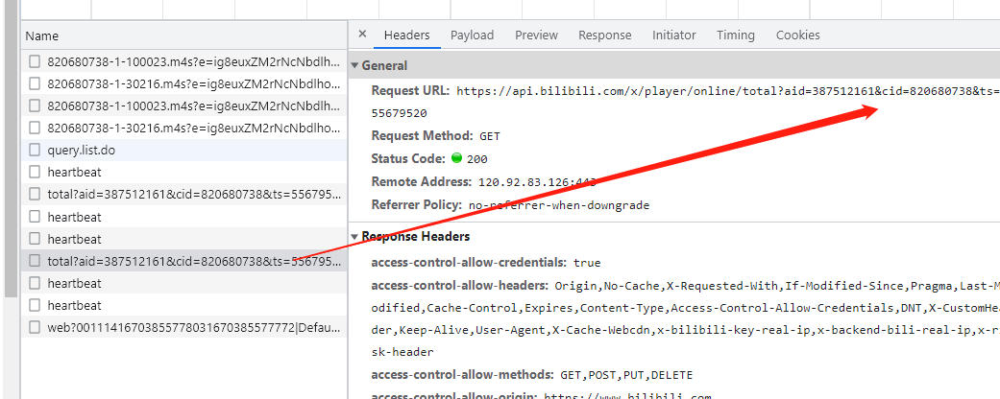

# 爬取哔哩哔哩弹幕信息案例


本次案例目标是抓取B站电视剧上的

[家有仙妻]: https://www.bilibili.com/bangumi/play/ep688651?from_spmid=666.25.episode.0	"初始url"

前十集的弹幕评论


## 使用工具:  

​	Google Chrome(108.0.5359.95)浏览器, IDE: PyCharm2022.2.2


## 网页数据分析:  

##### 	开始设想：

​		希望通过抓包工具(Network)对页面弹幕评论加载方式进行分析


​	待一段时间后，并没有发现特别有用的返回包,所以到这里可以猜测，弹幕数据是通过一个固定的请求按钮就可以直接返回所以的json数据


接下来我们来尝试点击查看历史弹幕，来请求获取返回的数据包


​	

点击原本展开的位置是返回了，如此多通过通过ajax交互返回的数据包

正当我开始吐槽的时候才发现事情远远没有这么简单！


当我点开返回包预览的时候发现这里的数据都被加密了(有点类似与字符加密)，也有可能是经过压缩gzip压缩的目前现在传输中基本上都是用压缩模式进行传输的。


到这里貌似也没有特别友好的解决方案。

那么我没有没有一种办法可以绕过字体反爬直接获取b站特定评论的api接口呢？

答案是有的


##### 确定方向:

留意这个包



这是b站一个接口给我们返回的数据链接

平常我们在看视频时，弹幕是出现在视频上的。实际上在网页中，弹幕是被隐藏在源代码中，以XML的数据格式进行加载的：

XML和JSON、YAML一样是一种通用的标记信息表达方式，可以简单的理解为一种记录数据的格式。

那么这个弹幕文件的url是什么呢？

它以一个固定的url地址+视频的cid+.xml组成。只要找到你想要的视频cid，替换这个url就可以爬取所有弹幕了（b站大部分网页给出的字幕限制是1000条）

```	python
url = f'http://comment.bilibili.com/{cid}.xml'
```


XML和描述网页的语言HTML非常像，所以你会在截图中看到<d></d>这样的标签。


解决方案:

好了 通过对xml文件的访问居然可以直接获取对应评论的所有信息，那么我们可以直接根据每个视频特定的cid代码就可以获取到对应的视频弹幕url了

我们把前十集的cid抓取出来放到一个列表里对每个特定评论的url链接进行拼接最终一次全部抓取到弹幕数据    

~~~python
# 家有仙妻 前十集的cid值
    cids = [820680426, 820680738, 820681510, 820682146, 820682647, 820682989, 820683722, 820684233, 820684795, 820685315]
~~~

然后通过循环对每个cid进行拼接:

~~~	python
for cid in cids:
	url = f'http://comment.bilibili.com/{cid}.xml'
~~~

从而获得每个评论仓库的特定地址

但是由于cid的特殊性，每个视频的cid都是独一无二的没有规律，所以每个cid都需要经过一次访问获得。

那么如何获取每个视频网页的cid呢？

##### 获取cid:

​	我们打开开发者工具，点击播放视频对页面进行监听直到发现heartbreat包

​	


## 获取数据

需要用到的python库:

~~~		python
import requests
~~~

请求数据

```python

    for cid in cids:
        fetch(cid)
        
```

树对象

```	python
def getTree(url):
    res = requests.get(url, headers=headers)
    res.encoding='utf-8'
    tree = etree.HTML(res.text.encode('utf-8'))
    return tree
```


抓取函数

```	python
def fetch(cid):


        url = f'http://comment.bilibili.com/{cid}.xml'
        print(f'{url}准备被抓取')
        # 获取树解析对象
        tree = getTree(url)
        # 解析方法返回一组数据列表
        rows = parse_data(tree)
```


## 解析数据

需要用到的python库

```python
from lxml import etree
```

解析函数

```python
def parse_data(tree):

    element_list = tree.xpath('//d')

    rows = []
    for attrs_ele in element_list:
        # 2695.34400,1,25,16707842,1670310086,0,355b8c5,1201407094729993216,11
        attr_ele = attrs_ele.xpath('./@p')[0]

        # 弹幕出现的时间
        emerge_time = attr_ele.split('.')[0]
        m_emerge_time = time.strftime("%H:%M:%S", time.gmtime(int(emerge_time)))
        # 时间戳
        timestamp = time.strftime('%Y-%m-%d %H:%M:%S', time.localtime(int(attr_ele.split(',')[4])))
        # 内容
        texts = attrs_ele.xpath('./text()')[0]
        rows.append([m_emerge_time, timestamp, texts])

    return rows
```


## 数据存储(CSV)

需要用到的python库:

```python
import csv
import os
```

创建总的文件夹、再分别存在每一集的CSV

```python
def save_data(episode_name, rows, index):
    
    # 创建csv文件夹来对每一集的弹幕进行存储
    if not os.path.exists(episode_name):
        os.mkdir(episode_name)
    csv_name = f'家有仙妻第{index}集'
    path = os.path.join(episode_name, csv_name + '.csv')
    with open(path, 'a', encoding='utf-8', newline='') as f:
        csv_writer = csv.writer(f)
        header = ['弹幕信息出现分钟', '弹幕出现日期', '弹幕内容']
        csv_writer.writerow(header)
        # 接下来循环遍历这个数组列表
        for row in rows:
            csv_writer.writerow(row)

    print(csv_name, '已存储完成')
```


到此，我们完全就可以通过修改cid值来获取所有我们想要获取的视频评论了。

最终效果展示: 


## ！！！

​	其实，对于file_name是可以做一个抓取函数的来抓取特定页面的电视剧名称，进而不需要手写file_name了(这个感兴趣的小伙伴可以自己实现，在这里只做案例，不负责封装类)，这样以后就可以直接修改cid来打包每一个想要的视频评论了，当然想要获取更多的评论，需要具体问题具体分析，根据特定电视剧的集数来获取对于的cid值再存入cid列表里就好啦！